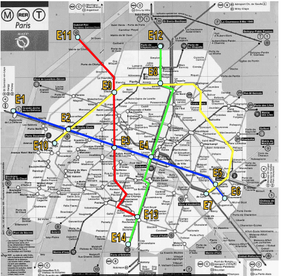

# Problema-do-metro-de-Paris
 
Suponha que queremos construir um sistema para auxiliar um usuário do metrô de Paris a saber o trajeto mais rápido entre a estação onde ele se encontra e a estação de destino. O usuário tem um painel com o mapa, podendo selecionar a sua estação de destino. O sistema então acende as luzes sobre o mapa mostrando o melhor trajeto a seguir (em termos de quais estações ele vai atravessar, e quais as conexões mais rápidas a fazer – se for o caso).

Considere que:

• a distância em linha reta entre duas estações quaisquer é dada em uma tabela.
Para facilitar a vida, considere apenas 4 linhas do metrô.

• a velocidade média de um trem é de 30km/h;

• tempo gasto para trocar de linha dentro de mesma estação (fazer baldeação) é de 4 minutos.

Formule e implemente este problema em termos de estado inicial, estado final, operadores e função de avaliação para Busca heurística com A*.

## A resolução e feita em 3 arquivos, o ***MP.c*** que responsável pela parte da resolução do problema, o ***GrafoMP.c*** que serve para criar No e Aresta(funções para gerenciamento um grafo), tambem contem o mapa em forma de grafo e o ***Pilha.c*** que responsável por cria Pilha(funções para gerenciamento uma pilha).

## O algoritmo busca resolver o problema dos missionários e canibais, por meio da implementação de *** A*(A Estrela) ***.

## Onde f(n) foi calculado por: 
## f(n) = (distancia real(distancia do No inicial até o No atual)/ 30km) + (distancia em linha reta do No  atual até o No final/ 30km) + 4*(Quantidade de estações passadas)

## No arquivo ***Out.txt*** podemos ver o alguns teste da resolução do problema.
